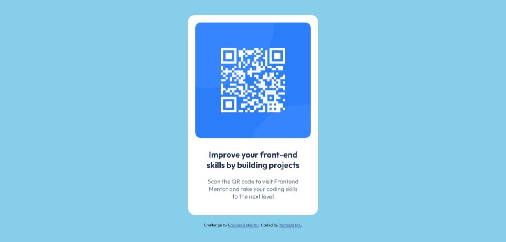

# Frontend Mentor - QR code component solution

This is a solution to the [QR code component challenge on Frontend Mentor](https://www.frontendmentor.io/challenges/qr-code-component-iux_sIO_H). Frontend Mentor challenges help you improve your coding skills by building realistic projects. 

## Table of contents

- [Overview](#overview)
  - [Screenshot](#screenshot)
  - [Links](#links)
- [My process](#my-process)
  - [Built with](#built-with)
  - [What I learned](#what-i-learned)
  - [Useful resources](#useful-resources)
- [Author](#author)

## Overview

### Screenshot

### Links

- Solution URL: [Click](https://github.com/yamadaMk12/qr-code-component-main)
- Live Site URL: [Click](https://yamadamk12.github.io/qr-code-component-main/)

## My process

### Built with

- Semantic HTML5 markup
- Flexbox
- Mobile-Responsive designes

### What I learned

using media query

### Useful resources

- [w3school](https://www.w3schools.com/) - This helped me for some CSS advises

## Author

- Github - [yamadaMk12](https://github.com/yamadaMk12/qr-code-component-main)
- Frontend Mentor - [@yamadaMk12](https://www.frontendmentor.io/profile/yamadaMk12)